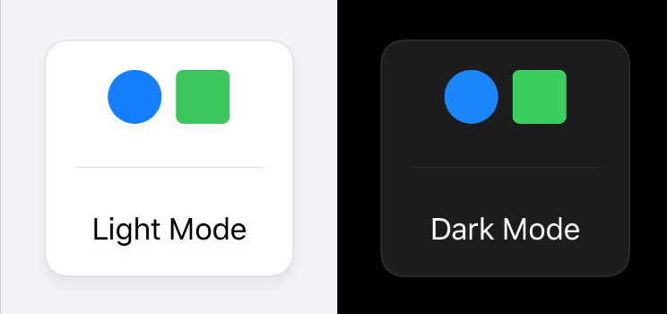

# SwiftUI-BackgroundCard
A simple SwiftUI ViewModifier to add a card-like background to a View.

## Usage

Simply apply the modifier to an exisiting View...

```
Text("This is some text, but it could be any SwiftUI view.")
  .modifier( BackgroundCard() )
```

... and you'll end up with this:


As you can see, it works nicely in dark mode as well (*additional padding and background has been added to these previews to better show off the cards*).


